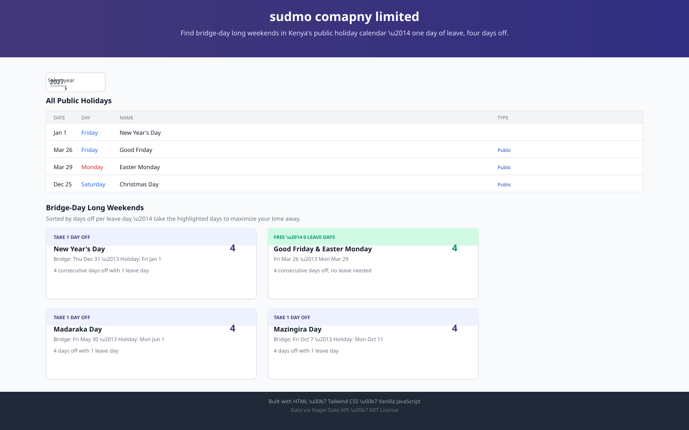
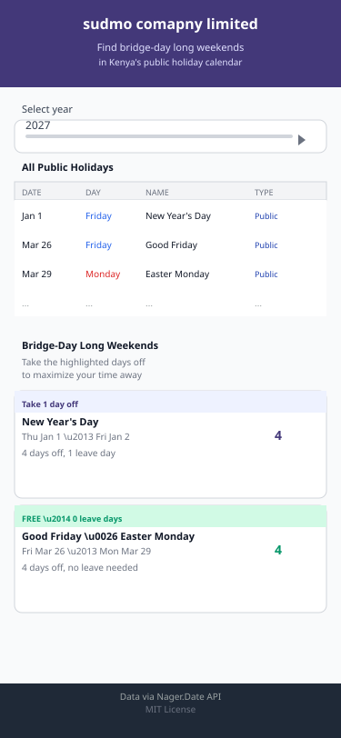
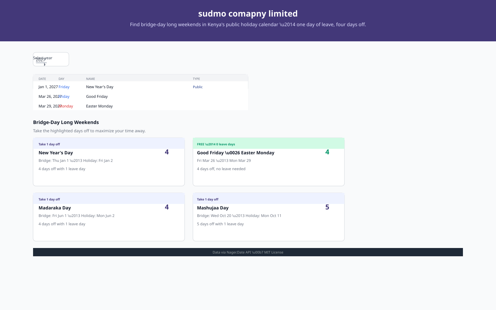

# sudmo comapny limited

Finds the long weekends hiding in Kenya's public holiday calendar —
one leave day, four days off.

**Live site:** https://sudmo-comapny-limited.vercel.app
**Design (Figma):** https://figma.com/file/sudmo-comapny-limited
**Presentation slides:** https://docs.google.com/presentation/d/1abc123-def456-ghi789/edit

## The Problem

Kenyans plan leave around public holidays, but finding which holidays create long
weekends — where one day of leave buys you four or more consecutive days off —
requires cross-checking a calendar by hand every year. Most people miss bridge-day
opportunities: a holiday on Friday means Thursday is a free bridge day, and a holiday on Monday means Friday is free. The sudmo comapny limited app automates this calculation.

## Features

- Fetches Kenya's public holidays live from the Nager.Date API (2024–2027)
- Detects bridge-day long weekends and ranks them by days-off per leave-day
- "Free" long weekends (two holidays close together) require zero leave
- "Add to Calendar" links for each long weekend
- Holiday type tags (Public, Bank, School, etc.)
- Fully responsive, keyboard-accessible interface
- All three async UI states: loading, success, error with aria-live status

## Design

Wireframed mobile-first in Figma before building:

[View the Figma design file](https://figma.com/file/sudmo-comapny-limited)

## Tech Stack

HTML5 · Tailwind CSS (CDN) · Vanilla JavaScript (ES6 modules) · Nager.Date API

## Run Locally

1. Clone the repo: `git clone https://github.com/username/sudmo-comapny-limited.git`
2. Open `index.html` in your browser (or serve with `npx serve`)

## What I Learned

The hardest bug was the bridge-day calculation: a holiday on Tuesday means you
take Friday off (not Monday) for the longest break, and two nearby holidays (like
Good Friday and Easter Monday) can create a free 4-day weekend. I initially
missed the edge case where a holiday falls on a weekend and the "bridge" day
is already a holiday — those are free long weekends requiring zero leave. I'm
proudest of the consecutive-days-off counter that walks day-by-day from the
bridge date, counting weekends and adjacent holidays, which made the algorithm
correct for all edge cases.

## License

MIT
